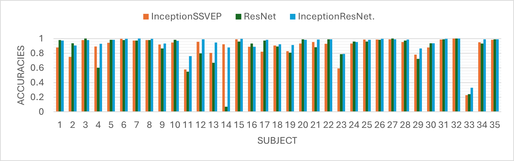

# InceptionResNet-SSVEP-BCI


## Table of Contents

- [Introduction](#introduction)
- [Installation](#installation)
- [Usage](#usage)
- [Dataset](#dataset)
- [Results](#results)
- [Contributing](#contributing)
- [License](#license)
- [Contact](#contact)

## Introduction

This repository contains the implementation of InceptionResNet for Steady-State Visual Evoked Potential (SSVEP) based Brain-Computer Interface (BCI). The proposed model achieves state-of-the-art performance on several benchmark datasets.

## Installation

1. Clone the repository:
    ```bash
    git clone https://github.com/Shengwei0516/InceptionResNet-SSVEP-BCI.git
    ```
2. Navigate to the project directory:
    ```bash
    cd InceptionResNet-SSVEP-BCI
    ```
3. Install the required packages:
    ```bash
    pip install -r requirements.txt
    ```
## Usage

To run the project, use the following command:
```python
python main.py
```

## Dataset

They dataset we used in our experiment is [Benchmark dataset](https://ieeexplore.ieee.org/document/7740878) by Yijun Wang, Xiaogang Chen, Xiaorong Gao, Shangkai Gao.

## Results

The performance of the InceptionResNet model for SSVEP-based BCI was evaluated against two baseline models: InceptionSSVEP and ResNet. The experimental results show that the InceptionResNet model outperforms the baseline models in terms of classification accuracy. The following chart illustrates the accuracies achieved by InceptionSSVEP, ResNet, and InceptionResNet models across 35 subjects:



## Contributing

Contributions are welcome! Please follow these steps to contribute:

1. Fork the repository.
2. Create a new branch (`git checkout -b feature-branch`).
3. Commit your changes (`git commit -am 'Add new feature'`).
4. Push to the branch (`git push origin feature-branch`).
5. Create a new Pull Request.

## License

This project is licensed under the MIT License. See the [LICENSE](LICENSE) file for details.

## Contact

For any questions or inquiries, please contact m11207330@mail.ntust.edu.tw
